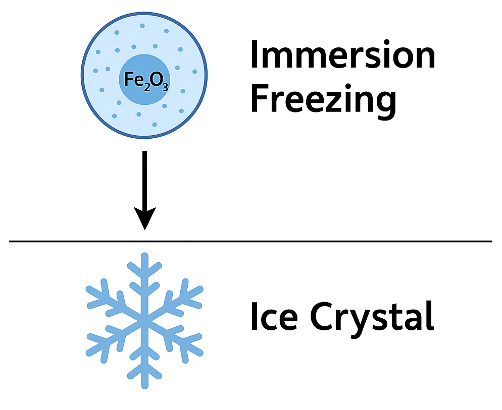

# Freezing Probability for Fe2O3 Aerosols

This repository provides a Python implementation of the **water-activity-based immersion freezing model**  
(*Knopf & Alpert, 2013*) for calculating the freezing probability of immersed Fe2O3 aerosol particles.

---

## ✨ Features

- Calculates freezing probability for immersed Fe~2~O~3~ aerosols
- Based on the **water-activity-based immersion freezing model**
- Input parameters:
  - Temperature **T** (Kelvin, *K*)
  - Exposure time *t* (seconds, *s*)
  - Particle diameter Dp (meters, *m*)

